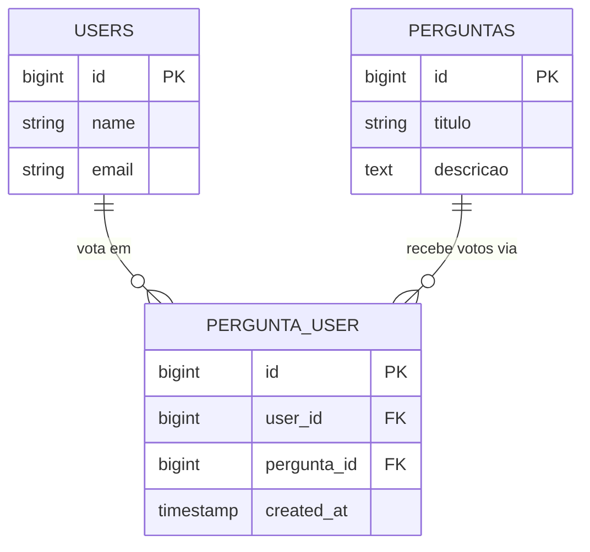

# 🔗 Relacionamentos N:M (Muitos para Muitos) & Tabelas Pivot

No ecossistema de bancos de dados relacionais, quando registros de uma tabela podem se relacionar com múltiplos registros de outra tabela simultaneamente, temos uma relação **Muitos para Muitos ($N:M$)**.

No Laravel, o Eloquent ORM gerencia essa complexidade através de uma **tabela intermediária** conhecida como **Tabela Pivot**.

---

## 🎯 O Problema da Relação 1:N

Em um relacionamento [[Conceitos/Database/relacionamento-n-1|1:N (Um para Muitos)]], a chave estrangeira (`user_id`) fica gravada diretamente na tabela filha.

**Exemplo que NÃO funciona com 1:N:**
- Um usuário pode curtir várias perguntas diferentes.
- Uma pergunta pode receber curtidas de vários usuários diferentes.

Se tentássemos colocar `user_id` na tabela `perguntas`, cada pergunta só poderia ter 1 curtida. Se colocássemos `pergunta_id` na tabela `users`, cada usuário só poderia curtir 1 pergunta.

A solução clássica da modelagem relacional é criar uma terceira tabela:



---

## 📐 Convenção de Nomes do Laravel

O Eloquent possui uma convenção estrita para o nome da tabela pivot:
1. Pegue os nomes dos dois models envolvidos no **singular**.
2. Ordene-os em **ordem alfabética**.
3. Junte-os com sublinhado (`_`) em formato *snake_case*.

| Models Envolvidos | Ordem Alfabética | Nome da Tabela Pivot |
| :--- | :--- | :--- |
| `User` e `Pergunta` | P vem antes de U | `pergunta_user` |
| `Evento` e `User` | E vem antes de U | `evento_user` |
| `Tag` e `Post` | P vem antes de T | `post_tag` |

> ⚠️ **Atenção:** Nunca use plural no nome da tabela pivot por convenção (ex: evite `perguntas_users`). Se usar um nome fora do padrão, terá que informar o nome explicitamente no Model.

---

## 🛠️ Criando a Migration da Pivot

Gere a migration no terminal:

```bash
php artisan make:migration create_pergunta_user_table --create=pergunta_user
```

Estrutura recomendada da migration com proteção contra duplicidade:

```php
public function up(): void
{
    Schema::create('pergunta_user', function (Blueprint $table) {
        $table->id();
        $table->foreignId('pergunta_id')->constrained()->cascadeOnDelete();
        $table->foreignId('user_id')->constrained()->cascadeOnDelete();
        $table->timestamps();

        // 🛡️ Impede que o mesmo usuário vote duas vezes na mesma pergunta!
        $table->unique(['pergunta_id', 'user_id']);
    });
}
```

---

## 💻 Configurando os Models (`belongsToMany`)

Nos dois lados da relação, usamos o método `belongsToMany`:

### No Model `Pergunta` (`app/Models/Pergunta.php`):
```php
namespace App\Models;

use Illuminate\Database\Eloquent\Model;
use Illuminate\Database\Eloquent\Relations\BelongsToMany;

class Pergunta extends Model
{
    // Usuários que votaram nesta pergunta
    public function votos(): BelongsToMany
    {
        return $this->belongsToMany(User::class, 'pergunta_user')->withTimestamps();
    }
}
```

### No Model `User` (`app/Models/User.php`):
```php
namespace App\Models;

use Illuminate\Foundation\Auth\User as Authenticatable;
use Illuminate\Database\Eloquent\Relations\BelongsToMany;

class User extends Authenticatable
{
    // Perguntas que este usuário curtiu/votou
    public function perguntasVotadas(): BelongsToMany
    {
        return $this->belongsToMany(Pergunta::class, 'pergunta_user')->withTimestamps();
    }
}
```

---

## 🕹️ Operações com Métodos Pivot

O Eloquent oferece métodos práticos para vincular e desvincular registros na tabela pivot sem precisar criar um Model dedicado para ela:

### 1. `attach()` — Inserir vínculo
Insere um registro na tabela pivot.
```php
// Usuário vota na pergunta de ID 15
$pergunta->votos()->attach(auth()->id());
```

### 2. `detach()` — Remover vínculo
Exclui o registro correspondente da pivot.
```php
// Usuário remove o voto da pergunta 15
$pergunta->votos()->detach(auth()->id());
```

### 3. `toggle()` — Alternar vínculo (Like / Unlike)
Se o vínculo existe, ele remove. Se não existe, ele insere! É a escolha ideal para botões de curtida, favoritos ou inscrição.
```php
// Se já curtiu, cancela. Se não curtiu, curte!
$pergunta->votos()->toggle(auth()->id());
```

---

## ⚡ Performance: Contagem com `withCount()`

Para saber quantos votos uma pergunta tem, **nunca** faça `$pergunta->votos->count()` em loops de listagem, pois isso carregaria todas as instâncias de usuários na memória (gerando gargalo [[Conceitos/Database/eager-loading-with|N+1]]).

Utilize `withCount()` no Controller:

```php
use App\Models\Pergunta;

$perguntas = Pergunta::withCount('votos')
    ->orderByDesc('votos_count') // Ordena pelas mais votadas!
    ->paginate(15);
```

Na view Blade, o Laravel disponibiliza automaticamente o atributo virtual `votos_count`:

```blade
<div class="pergunta-card">
    <p>{{ $pergunta->texto }}</p>
    <span class="badge">⭐ {{ $pergunta->votos_count }} votos</span>
</div>
```

---

## 📚 Conceitos Relacionados
- [[Conceitos/Database/model|Model (Eloquent ORM)]]
- [[Conceitos/Database/relacionamento-n-1|Relacionamentos 1:N no Eloquent]]
- [[Conceitos/Database/eager-loading-with|Eager Loading e Problema N+1]]
- [[Conceitos/Database/ordenacao-orderby|Ordenação de Consultas (orderBy)]]
