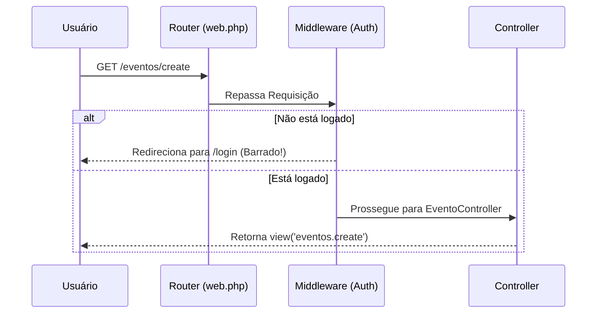

# 🛡️ Middlewares HTTP

Um **Middleware** funciona como uma série de "camadas" ou "guardas de segurança" pelas quais uma requisição HTTP precisa passar antes de chegar ao seu destino final (o [[HTTP/controller|Controller]]).

## A Analogia do Segurança de Balada

Imagine uma balada:
1. O **Navegador** é você tentando entrar.
2. O **Router** ([[HTTP/rotas|Rotas]]) é a porta de entrada.
3. O **Middleware** é o *Segurança*.
4. O **Controller** é a pista de dança.

Quando você tenta entrar (Requisição HTTP), o Segurança (Middleware) verifica a sua identidade. 
- Se você não tiver ingresso (não autenticado), ele te barra e manda de volta pra fila (Redireciona para a tela de Login).
- Se estiver tudo certo, ele deixa a requisição passar para o Controller.

## Representação Visual



## Como usar Middlewares nas Rotas

Você aplica middlewares nas suas [[HTTP/rotas|Rotas]] usando o método `->middleware()`.

```php
// Protegendo uma única rota: apenas usuários logados podem acessar
Route::get('/eventos/create', [EventoController::class, 'create'])
    ->middleware('auth');

// Aplicando middleware em um grupo de rotas
Route::middleware(['auth'])->group(function () {
    Route::post('/eventos', [EventoController::class, 'store']);
    Route::delete('/eventos/{id}', [EventoController::class, 'destroy']);
});
```

## Middlewares Comuns no Laravel

- `auth`: Verifica se o usuário está logado usando a [[Seguranca/auth-facade|Auth Facade]]. Se não estiver, redireciona para a rota nomeada `login`.
- `guest`: O oposto do `auth`. Só deixa passar quem **não** está logado (útil para a tela de login/registro).
- `verified`: Verifica se o usuário já confirmou seu e-mail.


## 📖 Documentação Oficial
- [Laravel Docs: Middleware](https://laravel.com/docs/middleware)
