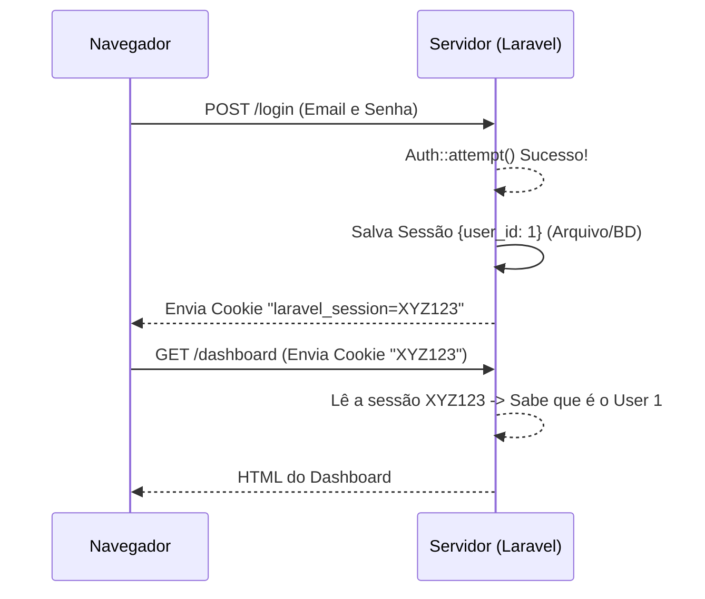

# 🍪 Sessões e Cookies

O protocolo HTTP é **"Stateless"** (sem estado). Isso significa que cada vez que você clica em um link ou envia um formulário, o servidor te esquece completamente. 

Para que o servidor "lembre" de você (por exemplo, que você fez login ou os itens do seu carrinho de compras), usamos **Sessões** e **Cookies**.

## Como Funciona?



1. **Sessão:** Os dados reais (quem é você, mensagens de erro flash) ficam guardados **no servidor** (em arquivos ou banco de dados).
2. **Cookie:** O servidor dá ao seu navegador um "Crachá" (uma string aleatória). O navegador guarda no Cookie e apresenta esse crachá em todas as próximas requisições.

## Evitando Ataques (Session Fixation)

No login, é vital destruir o crachá antigo e gerar um novo para impedir que hackers roubem a sessão de um usuário antes dele logar. O Laravel faz isso com:

```php
$request->session()->regenerate();
```

## 📖 Documentação Oficial
- [Laravel Docs: HTTP Session](https://laravel.com/docs/session)
