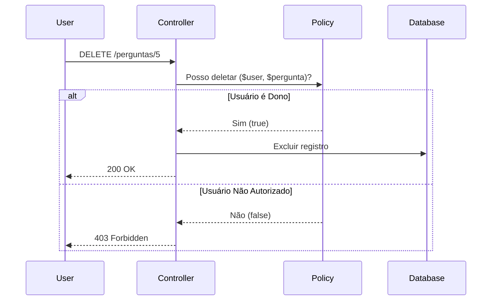

# Autorização (AuthZ) e Policies no Laravel

A confusão mais comum no desenvolvimento web é misturar **Autenticação (AuthN)** com **Autorização (AuthZ)**.
- **AuthN:** O sistema descobre *quem* você é (Login, Email/Senha).
- **AuthZ:** O sistema descobre *o que* você pode fazer (Permissões, ACL, Policies).

## Como Funciona no Laravel?

O Laravel usa classes chamadas **Policies** para mapear as permissões de CRUD (Create, Read, Update, Delete) de um respectivo Model.



## A Diretiva @can

Para evitar frustração de UX, a interface nunca deve mostrar um botão bloqueado. O Laravel nos dá a diretiva `@can` para esconder HTML na view:

```blade
@can('update', $post)
    <a href="/post/edit">Editar Post</a>
@endcan
```

## 📖 Documentação Oficial
- [Laravel Authorization (Policies)](https://laravel.com/docs/authorization#creating-policies)
